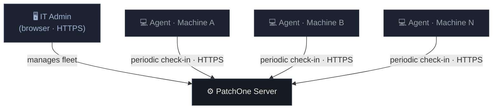

# How PatchOne Works

PatchOne has two main components that communicate securely over HTTPS.

## Components

### Dashboard (admin interface)

A web application your IT administrators use to manage the fleet. Runs on the PatchOne server and is accessible from any browser on your network.

### Agent (client software)

A lightweight Windows Service installed on each managed machine. The agent **always initiates** the connection — the server never connects to machines directly. This means:

- No inbound firewall rules needed on client machines
- Works behind NAT, corporate proxies, and VPNs
- The server cannot push arbitrary commands to machines

## Communication model

The agent checks in periodically, reports the machine's software inventory, and picks up any pending update jobs from the server. This pull model ensures the server acts as a trusted hub, not a remote-command executor.

## Deployment modes

| Mode | Description |
|---|---|
| **On-premises** | Single Windows Server on your LAN. No internet dependency after setup. |
| **Cloud** | Hosted behind a domain with TLS. Supports multiple client organisations. |

Both modes run the same software. Your choice depends on your network constraints and whether you need multi-tenant isolation.
