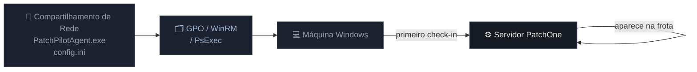

# Deploy do Agente

`PatchPilotAgent.exe` é um binário Windows autossuficiente (sem necessidade de Python). Implante-o como um Windows Service em cada máquina que deseja gerenciar.

## Antes de começar

Registre as exclusões de AV se usar Bitdefender GravityZone ou Windows Defender:

```powershell title="Registrar exclusões de AV (execute como Administrador)"
deploy\register_av_exclusion.ps1
```

Consulte [Coexistência com GravityZone](/docs/security/gravityzone) para detalhes.

## config.ini

Todos os métodos de deploy compartilham o mesmo `config.ini`. Substitua os valores destacados:

```ini title="config.ini" {2,3}
[server]
SERVER_URL=https://your-patchone-server
API_KEY=<your-api-key>
TENANT_ID=default
HEARTBEAT_INTERVAL=300

[agent]
LOG_LEVEL=INFO
```

| Configuração | Descrição | Padrão |
|---|---|---|
| `SERVER_URL` | URL base do servidor PatchOne | obrigatório |
| `TENANT_ID` | Identificador do tenant (`default` para on-prem) | `default` |
| `API_KEY` | Segredo compartilhado para autenticação do agente | obrigatório |
| `HEARTBEAT_INTERVAL` | Segundos entre check-ins | `300` |
| `LOG_LEVEL` | `DEBUG`, `INFO`, `WARNING`, `ERROR` | `INFO` |

## Fluxo de deploy



## Método 1 — Script de Inicialização via GPO (recomendado)

Ideal para ambientes com domínio.

### Configuração

1. Copie os arquivos para um compartilhamento de rede:

   ```
   \\server\sysvol\PatchOne\
     PatchPilotAgent.exe
     config.ini
   ```

2. No Gerenciamento de Política de Grupo, crie um novo GPO.

3. Navegue até:
   `Configuração do Computador → Configurações do Windows → Scripts → Inicialização`

4. Adicione um novo script de inicialização:
   - **Script:** `\\server\sysvol\PatchOne\PatchPilotAgent.exe`
   - **Parâmetros:** `install`

5. Vincule o GPO à Unidade Organizacional (OU) de destino.

6. Force uma atualização de Política de Grupo ou aguarde a próxima reinicialização.

As máquinas instalam o agente na próxima reinicialização e aparecem no dashboard em seguida.

### Verificar

```bat title="Verificar status do serviço em uma máquina de destino"
sc query PatchOneAgent
```

Saída esperada inclui `STATE: 4 RUNNING`.

## Método 2 — WinRM / PowerShell remoto

Use quando tiver acesso WinRM, mas sem GPO de domínio.

```powershell title="Deploy em massa via WinRM" showLineNumbers
$hosts = Get-Content hosts.txt
foreach ($h in $hosts) {
    $session = New-PSSession -ComputerName $h
    Copy-Item PatchPilotAgent.exe -Destination "C:\Program Files\PatchOne\" -ToSession $session
    Copy-Item config.ini          -Destination "C:\Program Files\PatchOne\" -ToSession $session
    Invoke-Command -Session $session -ScriptBlock {
        & "C:\Program Files\PatchOne\PatchPilotAgent.exe" install
        Start-Service PatchOneAgent
    }
    Remove-PSSession $session
}
```

`hosts.txt` — um hostname ou IP por linha.

## Método 3 — Script de deploy em massa (PsExec)

O script `deploy_agents.py` usa PsExec para deploy em larga escala.

```bat title="Deploy por lista de hosts"
python deploy\deploy_agents.py ^
  --hosts hosts.txt ^
  --server-url https://your-patchone-server ^
  --api-key <key>
```

```bat title="Deploy por faixa CIDR"
python deploy\deploy_agents.py ^
  --cidr 192.168.1.0/24 ^
  --server-url https://your-patchone-server ^
  --api-key <key>
```

:::warning Falsos positivos de AV com PsExec
O binário do agente pode acionar falsos positivos de AV quando implantado via PsExec. Registre as exclusões de AV primeiro ou prefira o método GPO.
:::

## Método 4 — Instalação manual

Para uma única máquina ou testes:

```bat title="Instalação manual (execute como Administrador)"
xcopy /Y PatchPilotAgent.exe "C:\Program Files\PatchOne\"
xcopy /Y config.ini          "C:\Program Files\PatchOne\"

"C:\Program Files\PatchOne\PatchPilotAgent.exe" install
sc start PatchOneAgent
```

## Gerenciamento do serviço do agente

| Ação | Comando |
|---|---|
| Iniciar | `sc start PatchOneAgent` |
| Parar | `sc stop PatchOneAgent` |
| Reiniciar | `sc stop PatchOneAgent && sc start PatchOneAgent` |
| Desinstalar | `PatchPilotAgent.exe remove` |
| Status | `sc query PatchOneAgent` |

## Arquivo de log do agente

Os logs são gravados em `C:\Program Files\PatchOne\agent.log`. O nível de log é controlado por `LOG_LEVEL` no `config.ini`.

## Atualização automática do agente

Quando o servidor publica uma nova versão, o agente se atualiza automaticamente. Consulte [Atualização Automática do Agente](/docs/agent/self-update) para detalhes.
