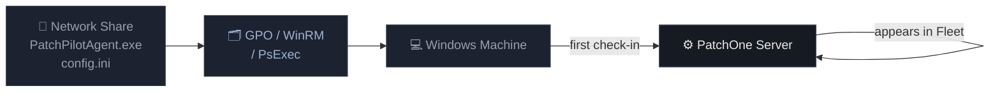

# Agent Deployment

`PatchPilotAgent.exe` is a self-contained Windows binary (no Python runtime required). Deploy it as a Windows Service on each machine you want to manage.

## Before you start

Ensure AV exclusions are registered if using Bitdefender GravityZone or Windows Defender:

```powershell title="Register AV exclusions (run as Administrator)"
deploy\register_av_exclusion.ps1
```

See [GravityZone coexistence](/docs/security/gravityzone) for details.

## config.ini

All deployment methods share the same `config.ini`. Replace the highlighted values:

```ini title="config.ini" {2,3}
[server]
SERVER_URL=https://your-patchone-server
API_KEY=<your-api-key>
TENANT_ID=default
HEARTBEAT_INTERVAL=300

[agent]
LOG_LEVEL=INFO
```

| Setting | Description | Default |
|---|---|---|
| `SERVER_URL` | Base URL of the PatchOne server | required |
| `TENANT_ID` | Tenant identifier (`default` for on-prem) | `default` |
| `API_KEY` | Shared secret for agent authentication | required |
| `HEARTBEAT_INTERVAL` | Seconds between check-ins | `300` |
| `LOG_LEVEL` | `DEBUG`, `INFO`, `WARNING`, `ERROR` | `INFO` |

## Deployment flow



## Method 1 — GPO Startup Script (recommended)

Best for domain environments.

### Setup

1. Copy files to a network share:

   ```
   \\server\sysvol\PatchOne\
     PatchPilotAgent.exe
     config.ini
   ```

2. In Group Policy Management, create a new GPO.

3. Navigate to:
   `Computer Configuration → Windows Settings → Scripts → Startup`

4. Add a new startup script:
   - **Script:** `\\server\sysvol\PatchOne\PatchPilotAgent.exe`
   - **Parameters:** `install`

5. Link the GPO to the target Organisational Unit (OU).

6. Force a Group Policy refresh or wait for the next machine restart.

Machines install the agent on next restart / GP refresh and appear in the dashboard shortly after.

### Verify

```bat title="Check service status on a target machine"
sc query PatchOneAgent
```

Expected output includes `STATE: 4 RUNNING`.

## Method 2 — WinRM / PowerShell remoting

Use when you have WinRM access but no domain GPO.

```powershell title="Bulk deploy via WinRM" showLineNumbers
$hosts = Get-Content hosts.txt
foreach ($h in $hosts) {
    $session = New-PSSession -ComputerName $h
    Copy-Item PatchPilotAgent.exe -Destination "C:\Program Files\PatchOne\" -ToSession $session
    Copy-Item config.ini          -Destination "C:\Program Files\PatchOne\" -ToSession $session
    Invoke-Command -Session $session -ScriptBlock {
        & "C:\Program Files\PatchOne\PatchPilotAgent.exe" install
        Start-Service PatchOneAgent
    }
    Remove-PSSession $session
}
```

`hosts.txt` — one hostname or IP per line.

## Method 3 — Mass deploy script (PsExec)

The `deploy_agents.py` script wraps PsExec for bulk deployment.

```bat title="Deploy by host list"
python deploy\deploy_agents.py ^
  --hosts hosts.txt ^
  --server-url https://your-patchone-server ^
  --api-key <key>
```

```bat title="Deploy by CIDR range"
python deploy\deploy_agents.py ^
  --cidr 192.168.1.0/24 ^
  --server-url https://your-patchone-server ^
  --api-key <key>
```

:::warning AV false positives with PsExec
The agent binary may trigger AV false positives when deployed via PsExec. Register AV exclusions first, or prefer the GPO method.
:::

## Method 4 — Manual install

For a single machine or testing:

```bat title="Manual install (run as Administrator)"
xcopy /Y PatchPilotAgent.exe "C:\Program Files\PatchOne\"
xcopy /Y config.ini          "C:\Program Files\PatchOne\"

"C:\Program Files\PatchOne\PatchPilotAgent.exe" install
sc start PatchOneAgent
```

## Agent service management

| Action | Command |
|---|---|
| Start | `sc start PatchOneAgent` |
| Stop | `sc stop PatchOneAgent` |
| Restart | `sc stop PatchOneAgent && sc start PatchOneAgent` |
| Uninstall | `PatchPilotAgent.exe remove` |
| Status | `sc query PatchOneAgent` |

## Agent log file

Logs are written to `C:\Program Files\PatchOne\agent.log`. Log level is controlled by `LOG_LEVEL` in `config.ini`.

## Agent self-update

When the server publishes a new agent version, the agent updates itself automatically. See [Agent Self-Update](/docs/agent/self-update) for details.
