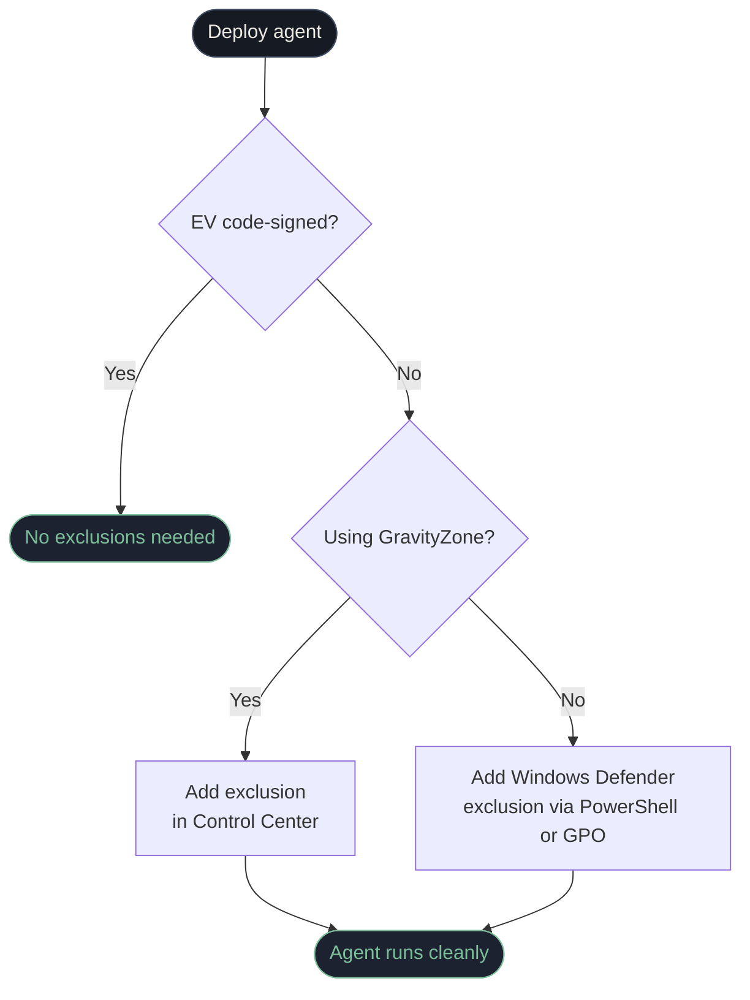

# GravityZone / AV Coexistence

PatchOne is designed to work alongside Bitdefender GravityZone and Windows Defender. Some AV engines may flag the agent binary on first deployment — this is a false positive that requires adding exclusions.

## Why the agent may trigger AV

The agent binary is a self-contained executable that includes its own runtime. Some behavioral AV engines flag this pattern as suspicious. The agent does not contain malware.

The recommended long-term solution is code-signing (see below), which causes most AV engines to whitelist the binary automatically.

## Solution 1 — Code-signing (recommended)

Sign `PatchPilotAgent.exe` with an EV (Extended Validation) code-signing certificate. Most AV engines whitelist EV-signed binaries without requiring manual exclusions.

EV certificates are available from DigiCert, Sectigo, and other certificate authorities.

## Solution 2 — Windows Defender exclusions

```powershell title="Add exclusions (run as Administrator)"
# Exclude the install directory
Add-MpPreference -ExclusionPath "C:\Program Files\PatchOne\"

# Exclude the agent process
Add-MpPreference -ExclusionProcess "PatchPilotAgent.exe"
```

To deploy via GPO:
`Computer Configuration → Preferences → Windows Settings → Registry`

## Solution 3 — GravityZone exclusion (Control Center)

1. Open GravityZone Control Center
2. Navigate to: **Policies → Antimalware → On-Access → Custom Exclusions**
3. Add the following exclusions:
   - **Path:** `C:\Program Files\PatchOne\`
   - **Process:** `PatchPilotAgent.exe`
4. Apply the policy to the target machine groups

## Automated exclusion script

```bat title="Run as Administrator — or deploy via GPO"
deploy\register_av_exclusion.ps1
```

## Exclusion decision flow



## Application Control considerations

Ensure that `winget` (the Windows Package Manager) is not blocked by Application Control policies, as the agent uses it to install and update software.
